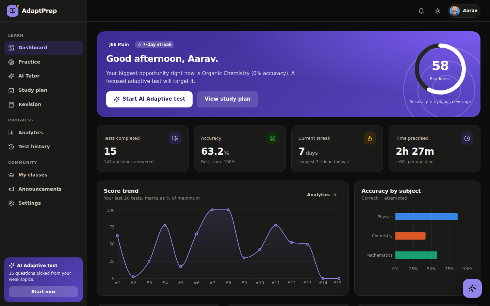
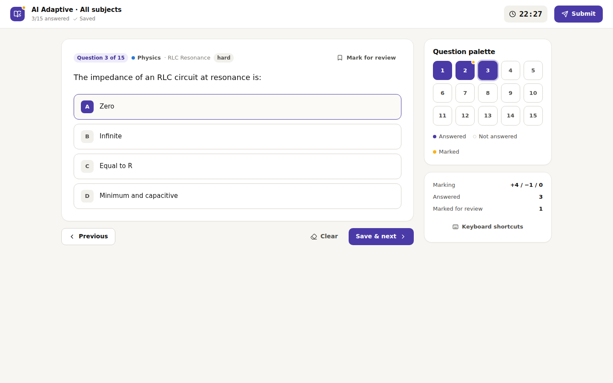
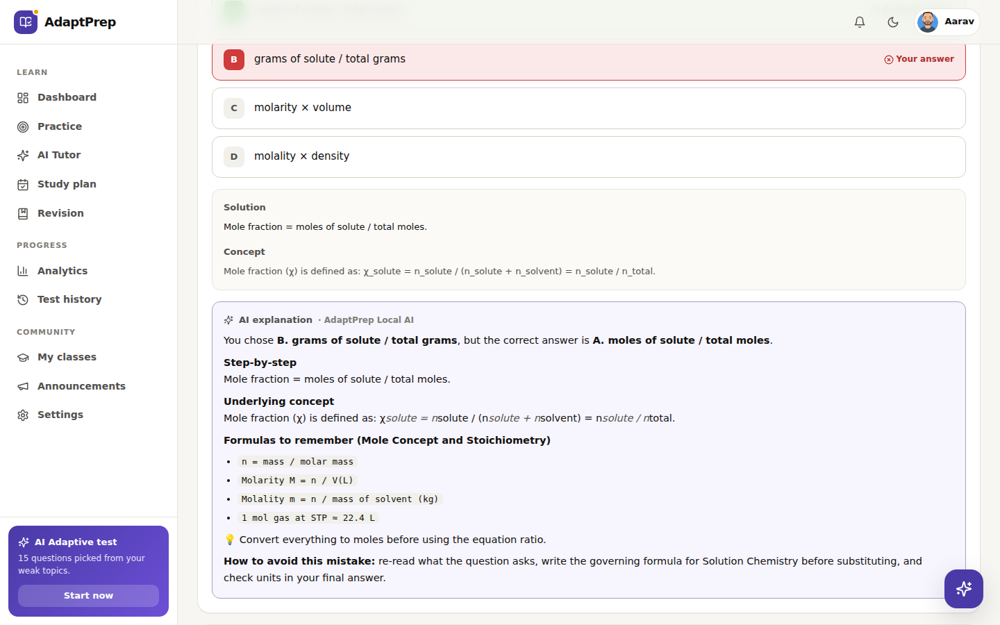
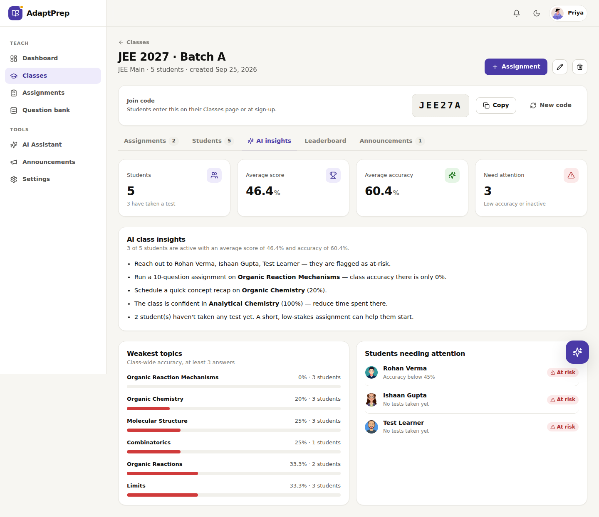

# AdaptPrep: AI-powered JEE & NEET preparation

👉 See [MY_CONTRIBUTION.md](MY_CONTRIBUTION.md) for my role in this project.

AdaptPrep is a full-stack exam-preparation platform for **students, teachers and administrators**. It finds where each student loses marks, then adapts the next test, the study plan and the explanations around it.

It runs with **zero configuration**: no database server, no API keys. A built-in AI engine powers every AI feature, and you can add a Gemini key to upgrade open-ended conversations to a large language model.

| Student dashboard (dark) | Exam-style test runner |
|---|---|
|  |  |
| **AI explanation of a mistake** | **Teacher: AI class insights** |
|  |  |

## Quick start

Requires Node.js 18 or newer.

```bash
npm run setup      # install backend + frontend dependencies
npm run dev        # API on :5000, web app on http://localhost:3000
```

On first start the server seeds 600 questions and a demo workspace. On the sign-in page, use one-click demo accounts or enter:

| Role    | Email                   | Password      |
|---------|-------------------------|---------------|
| Student | `student@adaptprep.dev` | `Student@123` |
| Student (NEET) | `neet@adaptprep.dev` | `Student@123` |
| Teacher | `teacher@adaptprep.dev` | `Teacher@123` |
| Admin   | `admin@adaptprep.dev`   | `Admin@123`   |

Class join codes in the demo: `JEE27A` (JEE) and `NEET27` (NEET).

**Production (single server):**

```bash
npm run setup && npm run build
JWT_SECRET=<long-random-string> npm start     # serves the app and API on :5000
```

Other commands: `npm test` (API test suite), `npm run reset-data` (wipe and re-seed on next start).

## What each role can do

### Students
- **Practice modes**: AI Adaptive (weighted to weak and unexplored topics), full mock (10 per subject), custom tests (subject, topics, difficulty), revision of past mistakes, and 60 practice sets.
- **Exam-grade test runner**: +4/−1 marking, server-enforced timer, question palette, mark-for-review, keyboard shortcuts, autosave (resumes after a refresh or crash) and auto-submit when time is up.
- **Results**: marks, accuracy, per-subject breakdown, full solution review, **"Why was I wrong?" AI explanations** and bookmarks.
- **Analytics**: readiness index, score trend, topic mastery, accuracy by subject and difficulty, time per question, streaks and an activity heatmap.
- **AI Tutor**: chat that knows your results. Ask "How am I doing?", "Explain projectile motion", "Formulas for electrochemistry", "Review my mistakes" or "Quiz me". A floating assistant is available on every page.
- **AI study plan**: a 7-day plan rebuilt from your latest results, with one-click practice and progress ticks.
- **Revision notebook**: open mistakes plus bookmarked questions, re-attemptable in place.
- **Classes**: join with a code, take assignments, and see announcements and a class leaderboard.

### Teachers
- Create classes with shareable join codes (regenerate or archive at any time), and manage the roster.
- **Assignments**: auto-pick by subject, topic and difficulty, or hand-pick from the bank. Set a due date, time limit and retake policy.
- **Assignment reports**: submission status (on time, late, missed), score stats, and per-question analysis showing which wrong option students chose.
- **AI class insights**: at-risk students, weakest and strongest class topics, and suggested next actions.
- Drill down into any student's full analytics and submitted answers.
- **Question bank**: write questions, or **generate verified questions with AI**, review them, and save.
- AI assistant for class summaries and question drafting, plus class announcements.

### Admins
- Platform overview: users, weekly activity, sign-ups, tests by subject and top students.
- **User management**: search and filter, create any role, change role, suspend or reactivate, reset password (one-time temporary password), delete.
- Oversight of every class, moderation of the full question bank (edit, archive, restore) and platform-wide announcements.
- **Audit log** of sensitive actions, and a **System & AI** page showing runtime and AI provider status.

## The AI

`backend/ai/` contains **AdaptPrep Local AI**, a deterministic engine that needs no network access:

| Capability | How it works |
|---|---|
| Tutor chat | Intent detection routes each message to performance analysis, study planning, mistake review, interactive quizzes (it remembers the pending question and grades your reply), exam strategy, or concept explanations. |
| Concept answers | TF-IDF retrieval over 53 curated syllabus notes (formulas and exam tips) and the question bank's worked solutions. |
| Explanations | Combines the solution, the concept, relevant formulas and why the chosen option was wrong. |
| Study plan and class insights | Computed from real analytics (topic accuracy, coverage, time, streaks, inactivity). |
| Question generation | 20 parametric templates across all four subjects. Answers are computed, and distractors are built from common mistakes, so every answer key is correct by construction. |

Set `GEMINI_API_KEY` in `backend/.env` to route open-ended chat and explanations to Google Gemini. Data-driven features (analytics, plans, quizzes, class insights) always stay local so they stay accurate. Any Gemini failure falls back to the local engine automatically.

## Security and fairness

- Correct answers and explanations **never reach the browser before submission**. Grading and time limits are enforced on the server, and expired tests are auto-submitted by a background sweeper.
- Role-based access on every endpoint. Teachers only see students in their own classes. Students can only bookmark questions they have already attempted.
- bcrypt password hashing. JWT sessions are revoked immediately on password change, role change or suspension.
- Admin accounts can't be self-registered, and the last active admin can't be demoted, suspended or deleted.
- Rate limiting on sign-in and AI endpoints, security headers, input validation and length limits, and constant-time sign-in for unknown emails.
- Sensitive actions are written to an audit log.

The API test suite (`npm test`) covers these guarantees end to end.

## Architecture

```
backend/                  Express API (Node 18+)
  ai/                     Local AI engine, knowledge base, retrieval, generator, Gemini provider
  db/store.js             Embedded JSON document store (atomic writes to storage/db.json)
  db/seed.js              Question bank import + demo workspace
  routes/                 auth, me, tests, analytics, classes, assignments, questions, ai, announcements, admin, public
  services/               attempts & grading, analytics, access control, audit
  data/subjects/          600 JEE/NEET questions with solutions
  test/api.test.js        End-to-end API tests (node:test)
frontend/                 React 18 + Vite + React Router + Recharts
  src/pages/{public,student,teacher,admin,shared}
  src/components/         UI kit, charts, chat panel, analytics view, question editor
  src/styles/app.css      Design system (light/dark tokens, CVD-validated chart palette)
```

The datastore is a single JSON file, which suits a single-server deployment. The `Store` interface (`find`, `insert`, `update`, `remove`) is the seam for swapping in MongoDB or PostgreSQL later.

## Configuration (`backend/.env`, all optional)

See [`backend/.env.example`](backend/.env.example): `PORT`, `JWT_SECRET` (auto-generated and persisted if unset; set it in production), `JWT_EXPIRE`, `CORS_ORIGIN`, `DB_FILE` (`:memory:` for throwaway data), `SEED_DEMO=false` with `ADMIN_EMAIL`/`ADMIN_PASSWORD` for a clean install, `GEMINI_API_KEY`, `GEMINI_MODEL`.

## License

MIT
